<!-- animated contribution graph: real data, boxes reveal cell by cell
     (regenerated daily by .github/workflows/update-profile-art.yml) -->

<h3><code>yash@github ~ $ ./contributions.sh</code></h3>

 
 

<!-- ascii portrait (left) + streak/numbers card (right). both svgs are
     840x880 so equal widths give equal heights.
     portrait: python scripts/prep_photo.py && python scripts/make_ascii_svg.py
     stats:    python scripts/render_stats_svg.py (same daily workflow) -->

<h3><code>yash@github ~ $ whoami</code></h3>

<table>
<tr>
<td valign="top"></td>
<td valign="top"></td>
</tr>
</table>

 

<h2 align="center">⚒️ Languages-Frameworks-Tools ⚒️</h2>
<h4 align="center">📖 I have been learning and exploring these following tools and languages</h4>
 

    
     

 

<!-- deployment -->
<h3 align="center">Database</h3>

  <a href="https://skillicons.dev">
      <picture>
        
      </picture>
  </a>

<!-- deployment -->
<h3 align="center">Deployment</h3>

  <a href="https://skillicons.dev">
      <picture>
        
      </picture>
  </a>

<!-- snake game
<picture>
  <source
    media="(prefers-color-scheme: dark)"
    srcset="https://raw.githubusercontent.com/Yash-Tibadiya/Yash-Tibadiya/output/github-contribution-grid-snake-dark.svg"
  />
  <source
    media="(prefers-color-scheme: light)"
    srcset="https://raw.githubusercontent.com/Yash-Tibadiya/Yash-Tibadiya/output/github-contribution-grid-snake.svg"
  />
  
</picture>
-->

